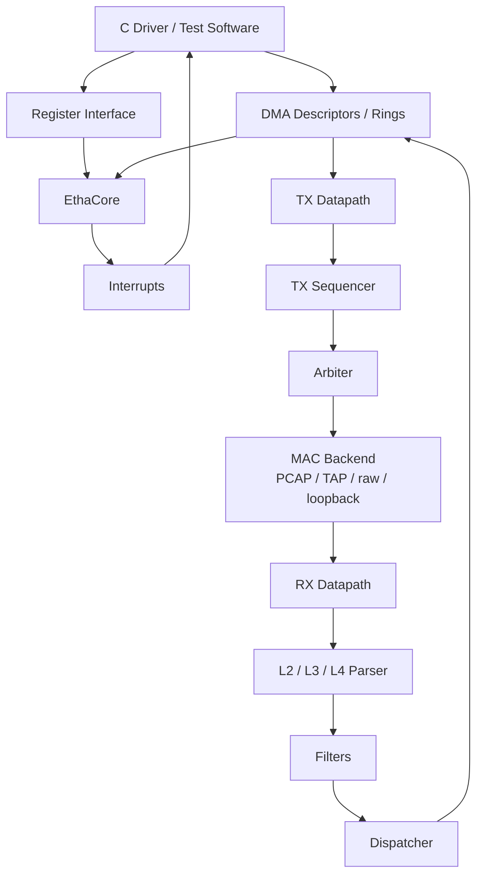

# etha_model

A **Rust-based functional model for exploring Ethernet/network accelerator architecture and hardware/software interfaces**.

`etha_model` is not intended to be a cycle-accurate hardware simulator. It is an executable device model for experimenting with the architecture contract between accelerator hardware and software: register maps, DMA descriptors, queue/ring organization, interrupts, datapath structure, filtering/dispatch, crypto offload, and observability.

The project is also an experiment in using **Rust as the source of truth for both model-side semantics and generated software-visible interfaces**.

## What it models

- Up to 16 RX/TX queue pairs
- RX packet parsing for Ethernet / IP / TCP / UDP
- EtherType and 5-tuple filtering
- RX dispatch into software-visible rings
- TX queue arbitration
- DMA-style descriptors and queue state
- Interrupt delivery
- PCAP, TAP, raw-socket and loopback MAC backends
- Standalone IPsec crypto acceleration
- Optional ROHC compression/decompression
- Chrome Trace based model observability
- C FFI and generated C headers

## Architecture



The RX pipeline is explicitly composed from independent stages:

```text
packet input
    ↓
L2/L3/L4 parsing
    ↓
filtering
    ↓
dispatch
    ↓
RX descriptor/ring
```

The model has explicit `Blocking`, `Dropped`, and parse-error semantics so pipeline stages can represent backpressure/stall behavior rather than behaving as a single monolithic packet-processing function.

## Hardware/software contract

A major part of the project is modeling the interface visible to firmware/driver software.

The register space is divided into RX, queue, and global regions, with per-channel RX/TX ring registers. Queue configuration, producer/consumer state, interrupts, filters, and enable/control state are represented through the same model used by the functional datapath.

### Single-source register and descriptor definitions

`etha_model` contains custom Rust procedural macros for register maps and descriptor layouts.

The model definitions describe things such as:

- bit positions and field widths
- access policy
- enums
- packed descriptor layouts
- explicit padding/layout constraints

From those Rust definitions the project can generate **C headers** for software clients. This keeps the executable model and the software-visible ABI derived from the same structured definition instead of maintaining independent register/descriptor descriptions by hand.

For example, RX result descriptors include frame metadata plus parsed L2/L3/L4 information and status fields in a fixed layout.

Generate headers with:

```bash
cargo run --bin header_gen -- [OPTIONS] <OUT_DIR>
```

## IPsec accelerator

The repository also contains a standalone IPsec/crypto accelerator model with its own queues, descriptors, register interface, engine pipeline, and session cache.

Supported primitives include:

- AES-128 / AES-256
- GCM / CCM / CBC / GMAC / CBC-MAC
- SHA1-HMAC / SHA256-HMAC / SHA512_256-HMAC
- up to 4 queues
- up to 64 security sessions
- key caching

This part of the project is useful for exploring the same HW/SW-interface ideas beyond the Ethernet datapath itself.

## ROHC

With the optional `rohc` feature, the model integrates the ROHC library for compression/decompression.

Supported profiles include:

- `ROHC_PROFILE_RTP`
- `ROHC_PROFILE_UDP`
- `ROHCv2_PROFILE_IP_UDP_RTP`
- `ROHCv2_PROFILE_IP_UDP`

## Observability and tracing

The model can emit Chrome Trace compatible JSON through Rust's `tracing` ecosystem.

Enable tracing from the C-facing API:

```c
etha_logger_en(ETHA_LOGGER_FULL);
/* run workload */
etha_logger_dis();
```

The output is written to `model.trace.json` and can be opened with Chrome/Chromium tracing tools.

A Python helper is included for post-processing:

```bash
python3 python/tracing_parser.py model.trace.json
```

It can summarize model activity such as:

- register reads/writes
- descriptor reads/writes
- data read/write traffic
- bus activity windows
- event counts and byte counts

**Note:** throughput values derived from trace timestamps describe model execution/activity unless an explicit hardware timing model is attached; they should not be interpreted as silicon performance estimates.

## Build

```bash
cargo build --profile release-lto --lib
```

The crate exposes `staticlib`, `cdylib`, and `rlib` outputs so the model can be embedded from Rust or C environments.

### Build with ROHC

ROHC is an optional external dependency. Build/install the ROHC library first, then:

```bash
cargo build --profile release-lto --lib --features="rohc"
```

To regenerate the ROHC Rust bindings:

```bash
cd rohc_bindgen
CLANG_PATH={CLANG_PATH} LIBCLANG_PATH={LIBCLANG_PATH} \
  cargo run -- {ROHC_HEADERS_DIR} {OUTPUT_PATH}
```

## Examples

Ethernet accelerator:

```bash
cargo build --profile release-lto --lib
cd examples/etha
make
./example.exe
```

IPsec accelerator:

```bash
cargo build --profile release-lto --lib
cd examples/etha_ipsec
make
./example.exe
```

ROHC:

```bash
cargo build --profile release-lto --lib --features="rohc"
cd examples/rohc
make
./example.exe
```

## Tests

```bash
cargo test
```

With ROHC:

```bash
cargo test --features="rohc"
```

## Project layout

```text
src/
├── etha/            Ethernet accelerator model
│   ├── desc/        RX/TX descriptors
│   ├── reg_if/      software-visible register interface
│   ├── *_parser.rs  packet parsing stages
│   ├── rx_*         RX datapath/filter/dispatch
│   └── tx_*         TX datapath/sequencing
├── etha_ipsec/      standalone IPsec/crypto accelerator
├── mac/             PCAP/TAP/raw/loopback backends
├── reg_if/          reusable register/ring infrastructure
├── irq.rs           interrupt infrastructure
└── logger.rs        tracing/observability

generator/
└── proc_macros/     register/descriptor DSL and C-header generation
```

## Why this project exists

`etha_model` is mainly an experiment in **hardware architecture modeling and HW/SW co-design**:

```text
architecture idea
      ↓
registers / queues / descriptors
      ↓
executable functional model
      ↓
software-visible C interface
      ↓
tests / tracing / analysis
```

The interesting part is not Ethernet alone; it is exploring how a hardware accelerator can be specified, modeled, driven by software, and instrumented as one coherent system.

## License

See [LICENSE](LICENSE).
